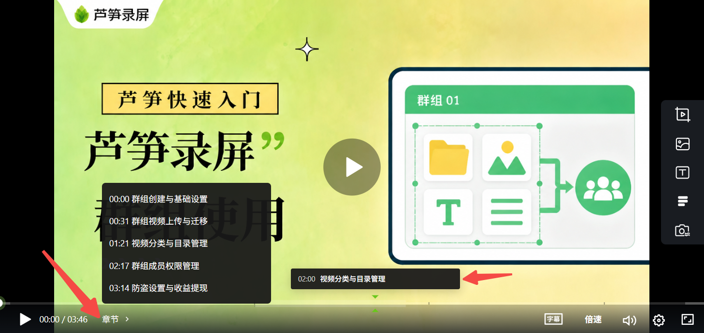
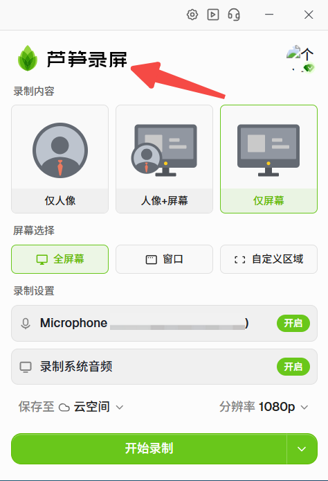
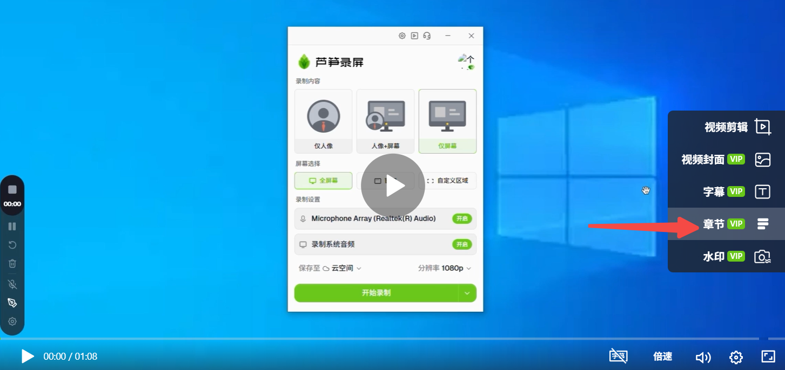
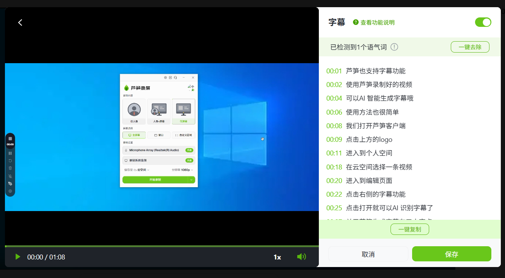

# 视频章节

## 图文教程 {#text1}

生成视频的章节后，可以快速预览或者调整到想要观看的视频位置了

<ImgCenter></ImgCenter>

1、打开芦笋的客户端，点击上方的logo，可以进入[芦笋云空间](https://lusun.com/dashboard/videos/)

<ImgCenter></ImgCenter>

2、点击任意一条视频，进入「编辑」页面，点击右侧的「章节」

<ImgCenter></ImgCenter>

3、打开「章节」按钮，就可以智能生成章节了。同时也支持直接修改生成文字内容

<ImgCenter></ImgCenter>
