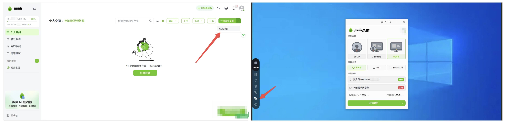
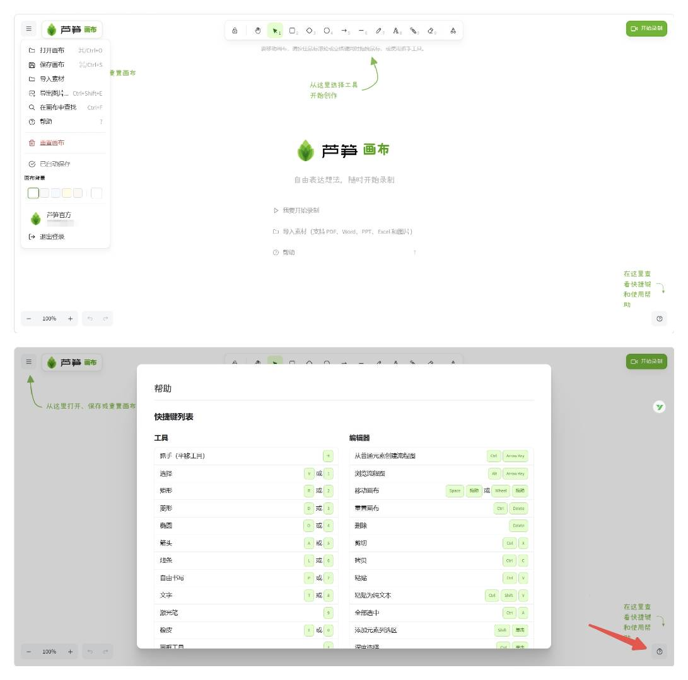
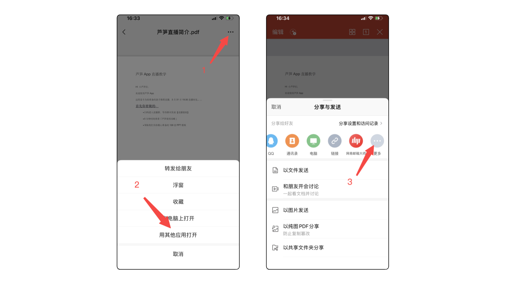

# 画笔功能

## 芦笋画布视频教程 {#huabu}

<iframe src="https://lusun.com/embed/?id=RcYxtf6sXuR" width="100%" height="500px" scrolling="no" border="0" frameborder="no" framespacing="0" allowfullscreen="true"></iframe>

打开方式：在网页端-个人空间，或电脑--客户端的录制侧边栏里面

<ImgCenter></ImgCenter>
<ImgDesc>画布打开方式</ImgDesc>

## 旧版视频教程 {#video}

<iframe src="https://lusun.com/embed/?id=UXTH3BaneQr" width="100%" height="500px" scrolling="no" border="0" frameborder="no" framespacing="0" allowfullscreen="true"></iframe>

## 图文教程 {#text}

### 电脑端画布教程 {#pc}

1、打开电脑上的芦笋客户端/点击客户端logo进入芦笋云空间

2、点击「开始录制」

3、在工具栏中调用画布功能（画布也支持快捷键切换功能）

<ImgCenter></ImgCenter>

### 安卓手机 / 平板教程 {#android}

1、打开手机上的芦笋 App

2、在三种录制模式中选择自己想要录制的模式，点击此模式就可以开始录制

<ImgCenter></ImgCenter>

3、录制中可以点击悬浮球中的画笔辅助讲解

<ImgCenter></ImgCenter>

### 苹果手机 / 平板教程 {#ios}

1、打开手机上的 pdf 文档

2、点击右侧三个点 - 使用芦笋打开

3、使用画笔功能辅助讲解

<ImgCenter></ImgCenter>

