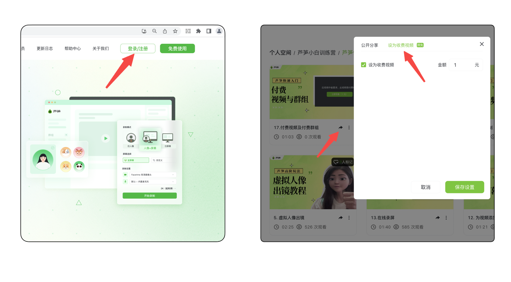

# 如何赚取收益

## 视频教程 {#video}

你可以通过以下这段视频快速了解芦笋录屏的设置付费功能演示

<iframe src="https://lusun.com/embed/?id=ojPUUe7S5eV" width="100%" height="500px" scrolling="no" border="0" frameborder="no" framespacing="0" allowfullscreen="true"></iframe>

## 图文教程 {#post}

### 👉付费视频 {#pay}

1. 你需要打开芦笋官网 [lusun.com](http://lusun.com/?ref=help.lusun.com)，点右上角登录账号，进入空间
2. 点击任意视频的分享键，设置为付费视频
3. 输入价格并保存即可

<ImgCenter></ImgCenter>
<ImgDesc>芦笋视频设置付费的方法</ImgDesc>

### 作者查看收益 & 提现 {#cash-out}

1. 打开芦笋空间 [https://lusun.com/dashboard/videos](https://lusun.com/dashboard/videos)，点击右上角头像
2. 进入交易中心查看
3. 提现规则：
   a.账户余额 = 视频收益 - 芦笋服务费（10%）
   b.可以随时提现，每人每天提现限额 5000 元，每月提现限额 10 万元
   c.若用户存在违背平台规则行为，芦笋有权执行冻结账户、扣除收益等操作

<ImgCenter></ImgCenter>
<ImgDesc>芦笋付费群组</ImgDesc>

## 👀 常见问题 {#faq}

**Q1: 其他人分享我的付费视频给别人，这些人能免费查看我的视频吗？**

A1：通过链接查看视频均需付费

**Q2：设置收费的视频，可以中途取消收费，重新免费开放吗？**

A2：可以，与设置收费的方法相同，恢复免费即可

***

推荐更多教程供你参考：[电脑端攻略](../basic/pc.md)｜[手机端攻略](../basic/phone.md)｜[会员特权](../basic/vip.md)｜[联系我们](../contact.md)
