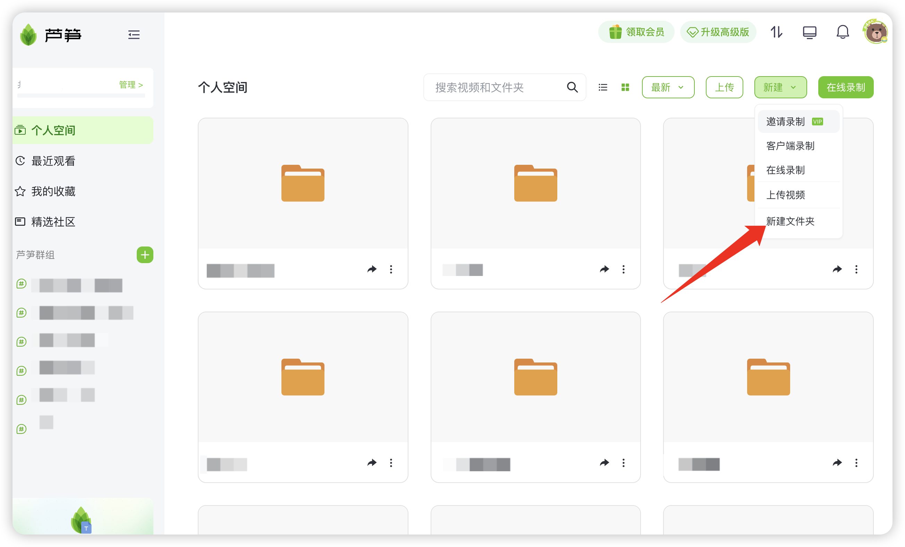
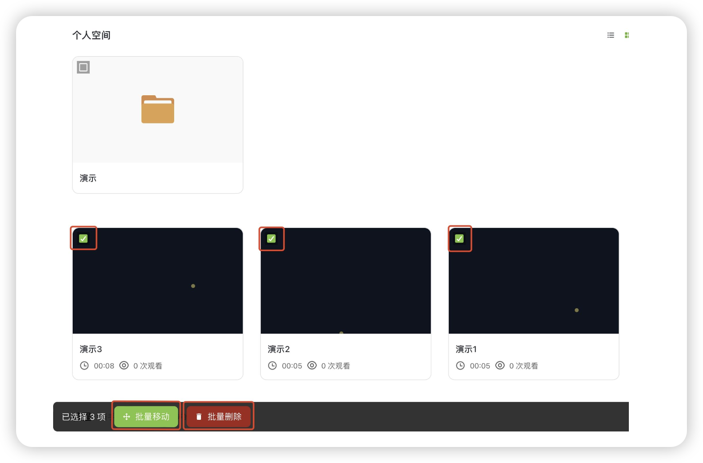

# 文件夹功能&批量操作

## 视频教程 {#video}

<iframe src="https://lusun.com/embed/?id=Ez1VF6dxGtQ" width="100%" height="500px" scrolling="no" border="0" frameborder="no" framespacing="0" allowfullscreen="true"></iframe>

### 文件夹功能 {#folder}

你可以通过访问「[芦笋录屏云空间](https://lusun.com/dashboard/videos)」 ，点击右上角新建 - 新建文件夹，即可创建文件夹

<ImgCenter></ImgCenter>
<ImgDesc>新建文件夹入口</ImgDesc>

### 批量操作 {#batch}

* 第一步：勾选需要批量操作的视频；
* 第二步：点击下方“批量移动”或“批量删除”，对视频进行批量操作

<ImgCenter></ImgCenter>
<ImgDesc>批量操作</ImgDesc>

***

推荐更多教程供你参考：[电脑端攻略](../basic/pc.md)｜[手机端攻略](../basic/phone.md)｜[会员特权](../basic/vip.md)｜[进阶教程](./)｜[联系我们](../contact.md)
