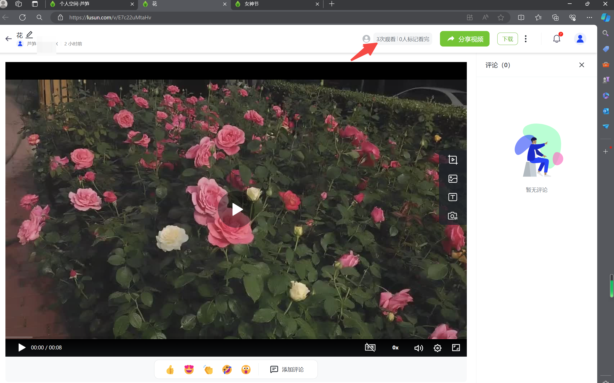

# 高级报表

## 视频教程 {#video}

<iframe src="https://lusun.com/embed/?id=KMBAXKO2YET" width="100%" height="500px" scrolling="no" border="0" frameborder="no" framespacing="0" allowfullscreen="true"></iframe>

## 图文教程 {#text}

桌面端：[芦笋云空间](https://lusun.com/dashboard/videos/?ref=help.lusun.com) - 任意视频的播放页面 - 视频的右上角为「高级报表」入口

<ImgCenter></ImgCenter>

&#x20;移动端：芦笋 App - 空间 - 任意视频的播放页面 - 视频下方可查看访客次数和观看次数以及标记观看次数

<ImgCenter></ImgCenter>

## 高级报表数据包含 {#excel}

电脑端：

单视频维度：观看人数、次数、点赞评论数、标记「已观看」人数

针对单个观看者维度：最近观看时间、观看次数、总观看时长、进度等

<ImgCenter></ImgCenter>

移动端：

单视频维度：访客数、播放数、评论数、点赞数、标记观看

针对单个观看者维度：最近观看时间、观看次数、总观看时长、进度等

<ImgCenter></ImgCenter>

## 常见问题 {#faq}

支持数据导出吗？
答：暂不支持，敬请期待
