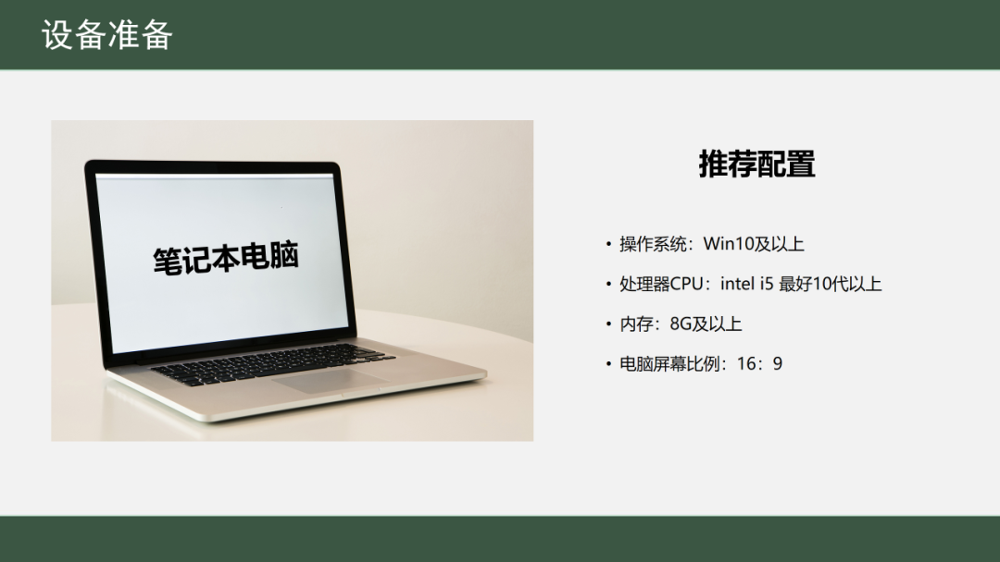
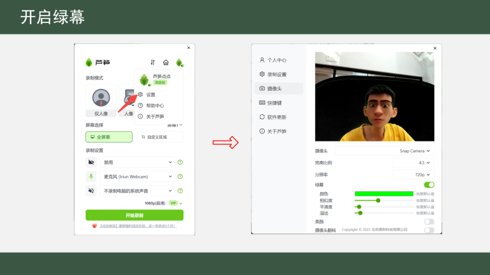
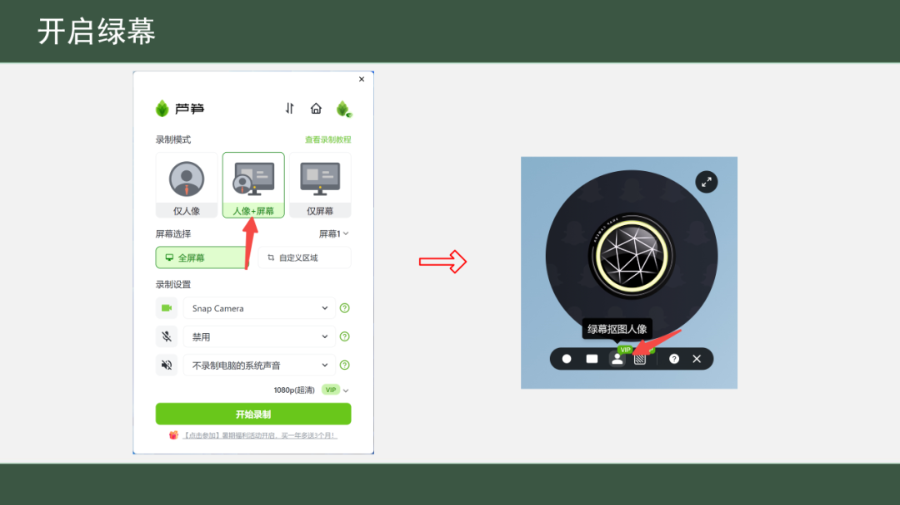

# 用芦笋制作“基础教育精品课”

## 用芦笋做精品课攻略 {#guide}

芦笋录屏作为不少老师录制精品课的必备工具，现在就出一个教程，帮助老师们只需使用芦笋录屏和芦笋提词器，在家也能轻松地制作出高质量的精品课视频。在录制过程中，提词器智能跟读，会根据演讲者语速实时提词，同时还能帮助老师一键绿幕抠像，提高视频质量。无需多次录制，每位老师都能轻松地录制出一次完美的精品课视频。

### 录制效果演示 {#demo}

<iframe src="https://lusun.com/embed/?id=X4p16S6Qwx4" width="100%" height="500px" scrolling="no" border="0" frameborder="no" framespacing="0" allowfullscreen="true"></iframe>

### 录制操作步骤 {#part}

#### 第一步：准备相关设备 {#first}

你需要选择一台复合电脑配置要求的硬件设备，如下图所示。需要注意的是，一定要确认好电脑的屏幕比例尺寸，以往精品课要求录制的视频比例是 16:9。目前市面上一些品牌的笔记本电脑屏幕比例不是的 16:9，所以在录制前找电脑售后客服确认一下电脑屏幕比例，避免录制课程视频不符合标准要求。

<ImgCenter></ImgCenter>
<ImgDesc>电脑推荐配置</ImgDesc>

其他设备要求：

* 摄像头：尽量购买一个高清 1080P 外接摄像头，录制出的人像更清晰，抠像也更精细
* 绿幕：尽量购买尺寸较大的绿幕，如 3×3 米或 3×2 米绿幕，并保证绿幕铺挂平整，避免出现阴影影响抠像
* 补光灯：如果在家录制拍摄，光线不均匀，推荐购买 1-2 个补光灯，使人物光源更均匀，抠像效果更精准

<ImgCenter></ImgCenter>
<ImgDesc>其他设备建议</ImgDesc>

#### 第二步：下载需要的软件 {#second}

推荐你下载使用 **芦笋录屏** 与 **芦笋提词器** 最新版

* 芦笋录屏 → [lusun.com](https://lusun.com)
* 芦笋提词器 → [tcq.lusun.com](https://tcq.lusun.com)

<ImgCenter></ImgCenter>
<ImgDesc>软件下载</ImgDesc>

#### 第三步：芦笋录屏设置 {#third}

你需要用到芦笋录屏的「绿幕抠像」功能：在设置中找到摄像头中的“绿幕”开关，开启后调整抠像参数，调整到背景为纯黑色，只展示人像部分即可。

<ImgCenter></ImgCenter>
<ImgDesc>开启绿幕</ImgDesc>

调试完成完成后，选择「人像 + 屏幕」录制模式，在摄像头下方选择「绿幕抠图人像」，就能实现绿幕抠像录制。

<ImgCenter></ImgCenter>
<ImgDesc>人像 + 屏幕录制</ImgDesc>

#### 第四步：芦笋提词器设置 {fourth}

你可以在下载芦笋提词器后 [如何下载请点击查看](https://docs.lusun.com/tcq/basic/download.html)，直接创建一条台词，然后开启提词

1. **创建词条**

打开芦笋提词器，点击左上角顶部“+”，输入词条标题，以及提词内容，成功创建一个词条；当然如果你有已经准备好的词条内容，比如 Word 文档，你可以直接使用复制，粘贴进来

<ImgCenter></ImgCenter>
<ImgDesc>创建台词</ImgDesc>

2. **开启提词**

目前芦笋提词器有两种提词模式，匀速模式和智能跟读模式，详细内容可参考 [芦笋提词器开启提词教程](https://docs.lusun.com/tcq/basic/prompt.html)

3. **隐形提词**

当你在芦笋提词器的客户端，开启设置「隐形提词」后，录制视频时演讲者可以看到提词内容，但视频成片不会显示提词器，效果图请参考：

<ImgCenter></ImgCenter>
<ImgDesc>隐形提词后的录制效果</ImgDesc>

芦笋提词器如何开启隐形提词呢？

<ImgCenter></ImgCenter>
<ImgDesc>芦笋提词设置隐形</ImgDesc>

***

推荐阅读：[芦笋录屏欢迎你](../)｜[芦笋提词器欢迎你](https://docs.lusun.com/tcq/)
