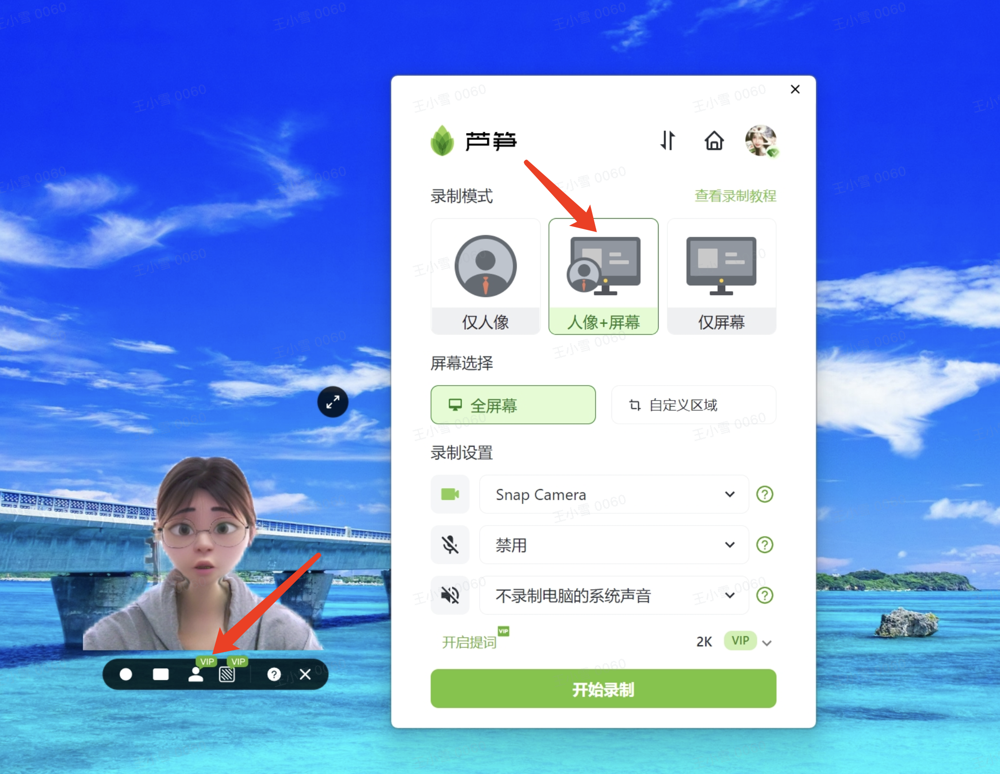
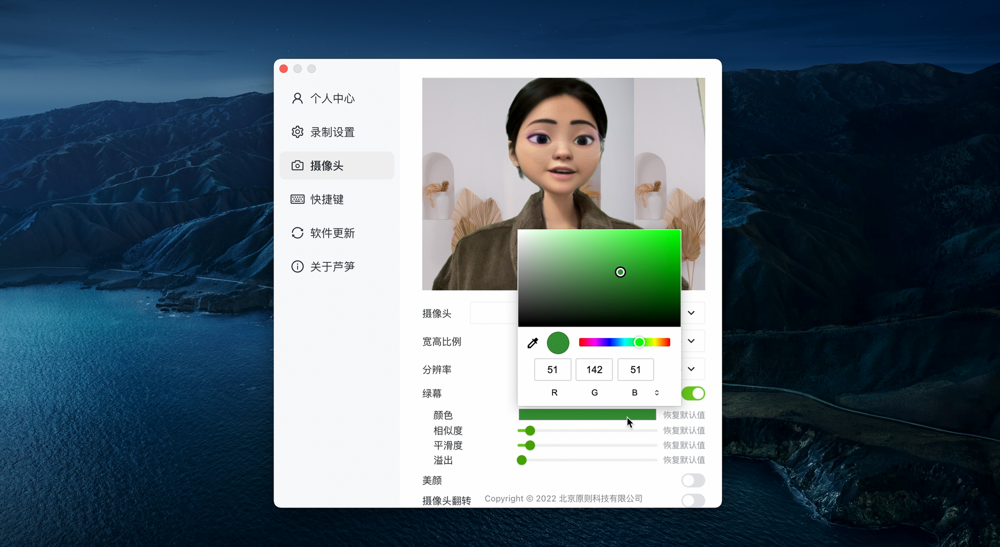
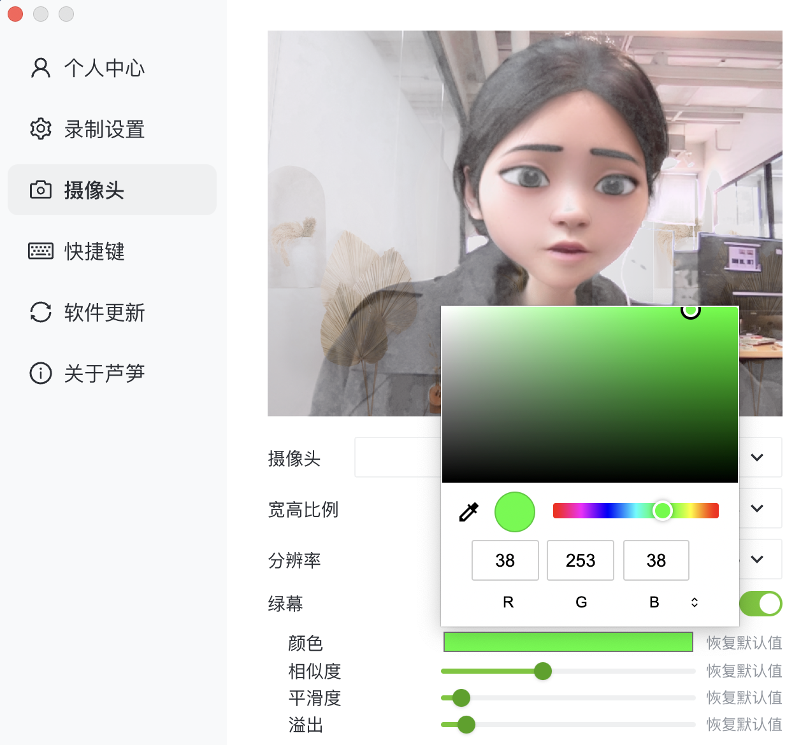

# 两种人像抠图方式

## 视频教程 {#video}

<iframe src="https://lusun.com/embed/?id=Ikd1Rw6476i" width="100%" height="500px" scrolling="no" border="0" frameborder="no" framespacing="0" allowfullscreen="true"></iframe>

## 图文教程 {#post}

### 👉 白墙抠像法 {#white}

1. 打开芦笋客户端，选择「人像 + 屏幕」方式
2. 鼠标放到人像上，点击「抠图人像」即可
3. 打开要讲解的 PPT 等页面，人像自动出现在页面上，即可「开始录制」

<ImgCenter></ImgCenter>
<ImgDesc>芦笋录屏一键抠人像</ImgDesc>

### 👉 绿幕抠像法 {#green}

1. 打开客户端，点击头像 - 设置 - 摄像头设置
2. 打开绿幕功能即可一键扣除背景
3. 调整颜色、相似度等参数，实现较好的抠图效果后即可「开始录制」

<ImgCenter></ImgCenter>
<ImgDesc>芦笋绿幕抠像</ImgDesc>

## 👀 常见问题 {#faq}

**Q1：使用真实背景时可以出现人像，选择抠像时人像是灰色的，一直转圈**

A1：常见于 win10 以下的系统设备，需要下载驱动大师更新摄像头驱动后，再使用抠像功能

<ImgCenter></ImgCenter>

**Q2：点击白墙抠像法的「抠图人像」没有反应**

A2：「绿幕抠像」模式打开时，没有办法使用「白墙抠像」，先打开头像 - 设置 - 摄像头设置 - 关闭绿幕抠像，然后再尝试抠图人像功能

**Q3: 使用「绿幕抠像」法，打开绿布功能后，人像和背景都非常模糊**

A3：「绿幕抠像」法需要在绿幕前录制，准备好绿布再打开该功能，没有绿布的情况下人像和背景都是模糊的

<ImgCenter></ImgCenter>
<ImgDesc>人和背景模糊的状态</ImgDesc>

芦笋录屏官网：请访问 [lusun.com](https://lusun.com)

***

推荐阅读：[芦笋录屏欢迎你](../)
