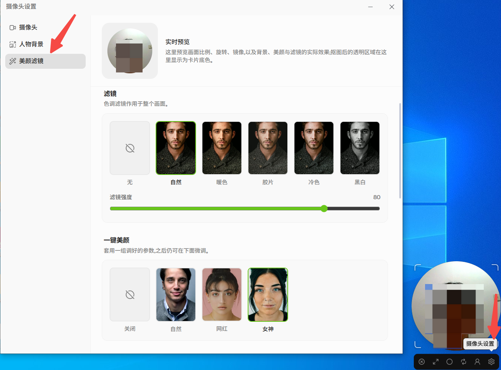
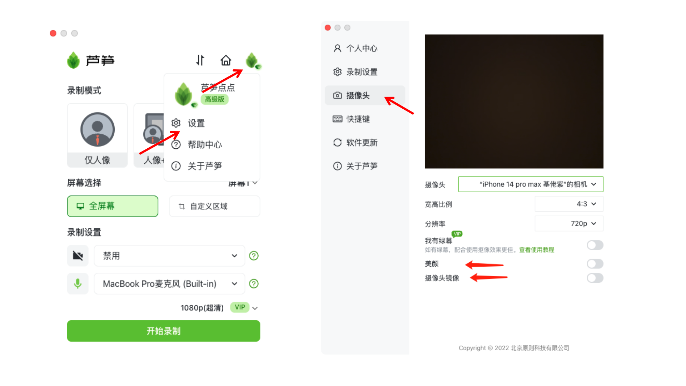
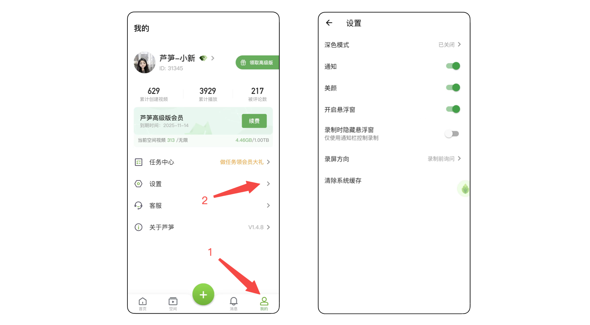
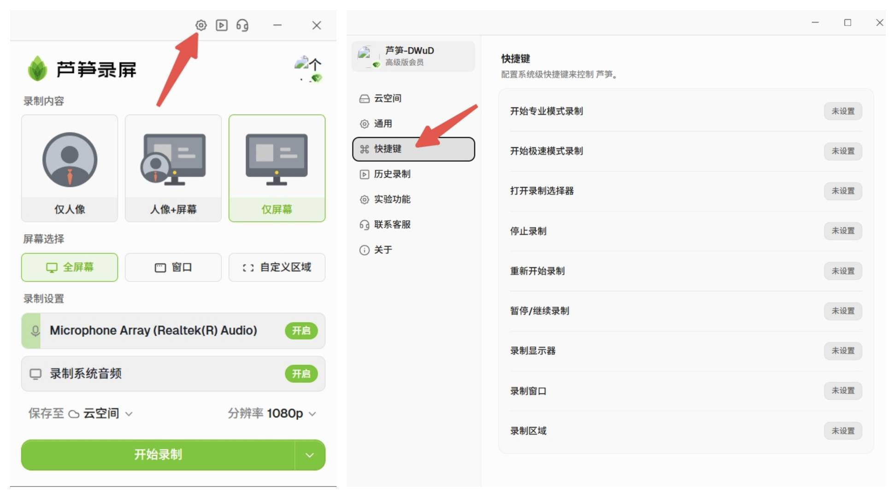
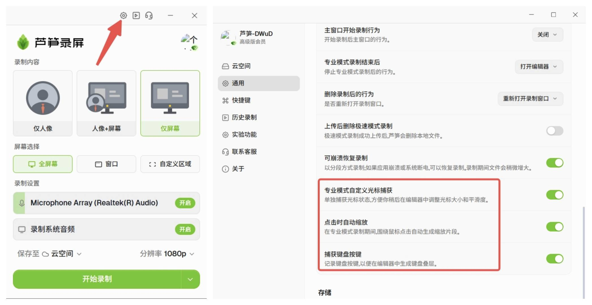

# 美颜等更多设置

你将通过这篇文档了解到如何开启/关闭美颜、镜像、快捷键设置和鼠标放缩/键盘捕获等功能。

<iframe src="https://lusun.com/embed/?id=iCqd6nkzT7D" width="100%" height="500px" scrolling="no" border="0" frameborder="no" framespacing="0" allowfullscreen="true"></iframe>

### 美颜设置 {#beauty}

目前芦笋录屏的电脑端以及安卓手机端，都可以自主开关美颜，iOS 还暂时不支持。

#### 电脑端如何开启 {#pc}

你可以通过打开芦笋录屏客户端 - 「人像+屏幕」方式 - 人像下方的摄像头设置，进行操作。

<ImgCenter></ImgCenter>
<ImgDesc>芦笋录屏电脑端美颜设置（新版）</ImgDesc>

<ImgCenter></ImgCenter>
<ImgDesc>芦笋录屏电脑端美颜设置（旧版）</ImgDesc>

#### 安卓手机端如何开启 {#android}

你可以打开芦笋录屏 App - 右下角我的 - 关于芦笋 - 美颜开关，进行操作

<ImgCenter></ImgCenter>
<ImgDesc>安卓手机开启美颜</ImgDesc>

### 快捷键功能 {#shortcut}

路径：打开芦笋录屏客户端 - 上方的设置 - 快捷键

<ImgCenter></ImgCenter>
<ImgDesc>芦笋录屏快捷键设置</ImgDesc>

### 鼠标放缩 {#scaling}

路径：打开芦笋录屏客户端 - 上方的设置 - 通用

<ImgCenter></ImgCenter>
<ImgDesc>芦笋鼠标放缩/键盘捕获路径</ImgDesc>

***

推荐更多教程供你参考：[电脑端攻略](../basic/pc.md)｜[手机端攻略](../basic/phone.md)｜[会员特权](../basic/vip.md)｜[联系我们](../contact.md)
