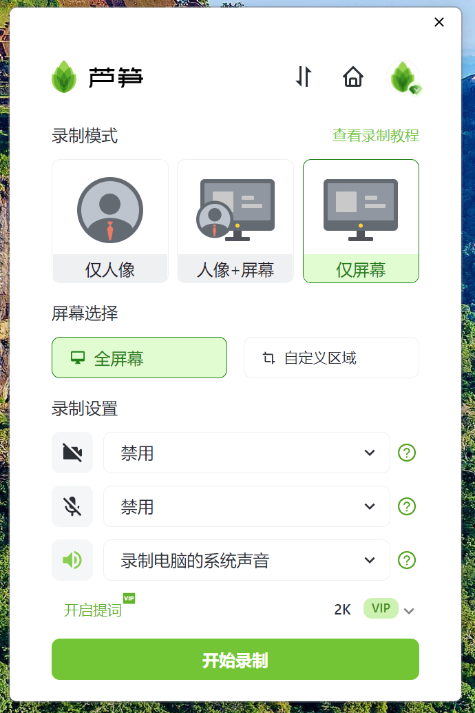
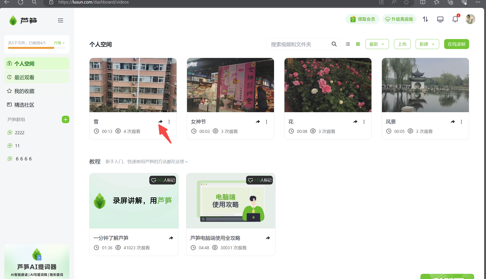
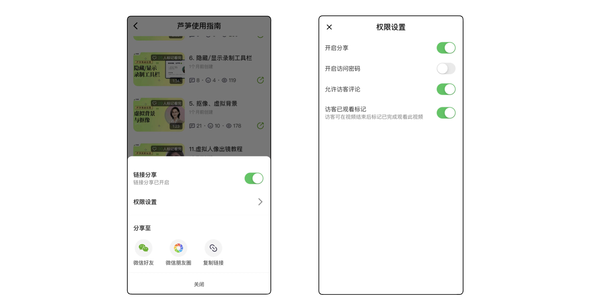

# 视频分享

## 视频教程 {#video}

<iframe src="https://lusun.com/embed/?id=WCGrWfUqbGh" width="100%" height="500px" scrolling="no" border="0" frameborder="no" framespacing="0" allowfullscreen="true"></iframe>

## 图文教程 {#text}

::: warning 注意
不分享的视频会以仅作者可见的形式存储在云空间，收到链接的访客可以查看单视频/文件夹，不可访问作者空间。不分享的视频别人无法查看
:::

### 电脑端分享步骤 {#pc}

1、打开芦笋的客户端，点击上方的小房子图标，可以进入[芦笋云空间](https://lusun.com/dashboard/videos/?ref=help.lusun.com)

<ImgCenter></ImgCenter>

2、找到想要分享的视频，点击下方的一个分享键，就来到了分享设置的界面

<ImgCenter></ImgCenter>

3、单个视频的分享：分享的方式有公开分享和设为收费视频

公开分享的设置：

「1」放分享，打开链接即可观看

「2」密码分享，输入密码才能观看

「3」作者随时打开/关闭分享，关闭后视频链接无法打开

<ImgCenter></ImgCenter>

多个视频的分享：在空间创建文件夹，点击右上角的「新建」，然后「新建文件夹」，点击分享键，进行链接或二维码即可分享

<ImgCenter></ImgCenter>

### 移动端分享的步骤 {#mobile}

打开芦笋 App - 点击视频/文件夹右侧三个点 - 分享设置 - 复制链接

<ImgCenter></ImgCenter>

## 分享的途径 {#share}

* 微信、QQ 等聊天工具
* 飞书等文档工具
* 知乎等内容平台

## 常见问题 {#faq}

* 视频已经分享出去，再关闭分享链接，其他人还能看吗？
答：其他人不可见
