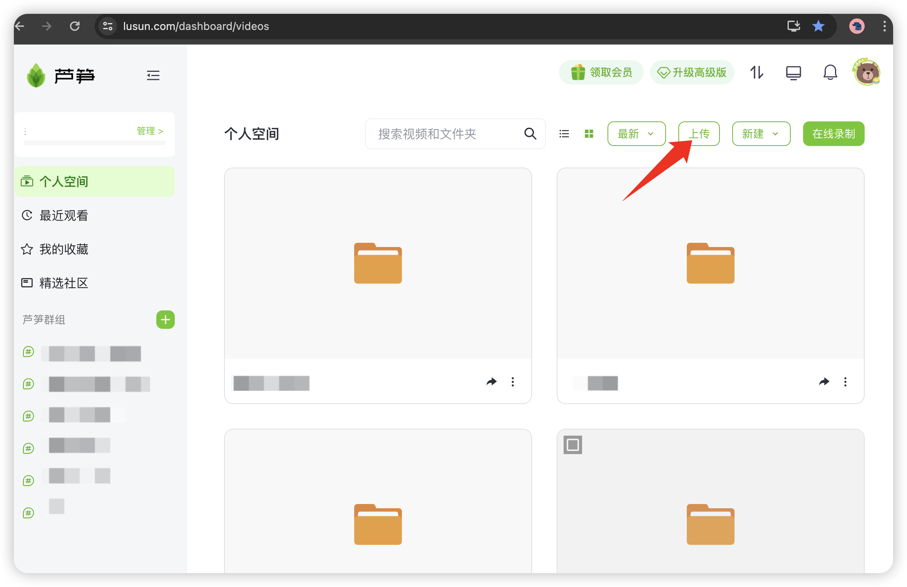
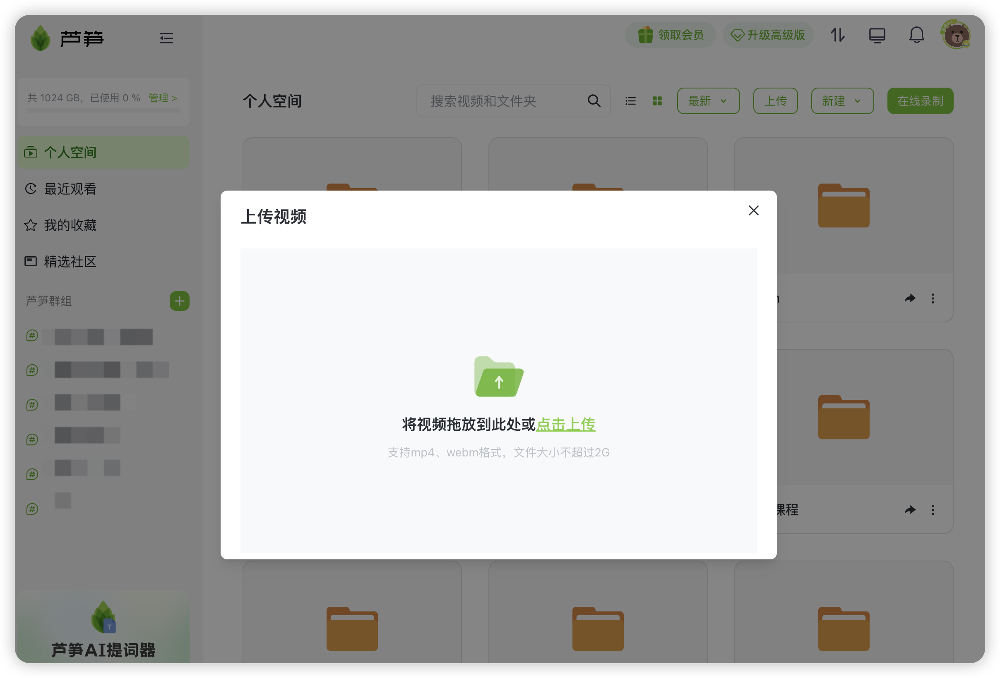

# 上传本地视频到芦笋空间

## 视频教程 {#video}

<iframe src="https://lusun.com/embed/?id=0ycmmayPeOm" width="100%" height="500px" scrolling="no" border="0" frameborder="no" framespacing="0" allowfullscreen="true"></iframe>

### 电脑端上传 {#pc}

你可以通过访问「[芦笋录屏云空间](https://lusun.com/dashboard/videos)」 ，点右上角「上传」按钮，需要注意的是，免费版可上传文件大小不超过 300M，高级版可上传文件大小不超过 2G

<ImgCenter></ImgCenter>
<ImgDesc>电脑端个人空间的上传入口</ImgDesc>

<ImgCenter></ImgCenter>
<ImgDesc>文件上传要求</ImgDesc>

### 手机端上传 {#phone}

你可以打开芦笋录屏 APP，点击底部「空间」 - 「+号」 - 「上传视频」

<ImgCenter></ImgCenter>
<ImgDesc>移动端上传视频</ImgDesc>

***

推荐更多教程供你参考：[电脑端攻略](../basic/pc.md)｜[手机端攻略](../basic/phone.md)｜[会员特权](../basic/vip.md)｜[进阶教程](./)｜[联系我们](../contact.md)