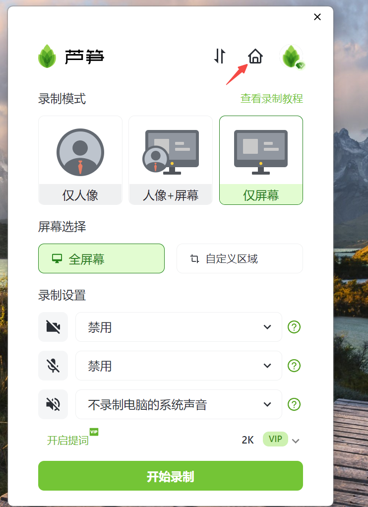
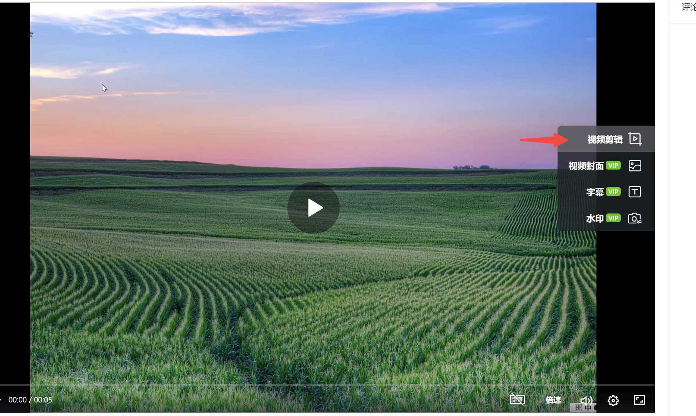
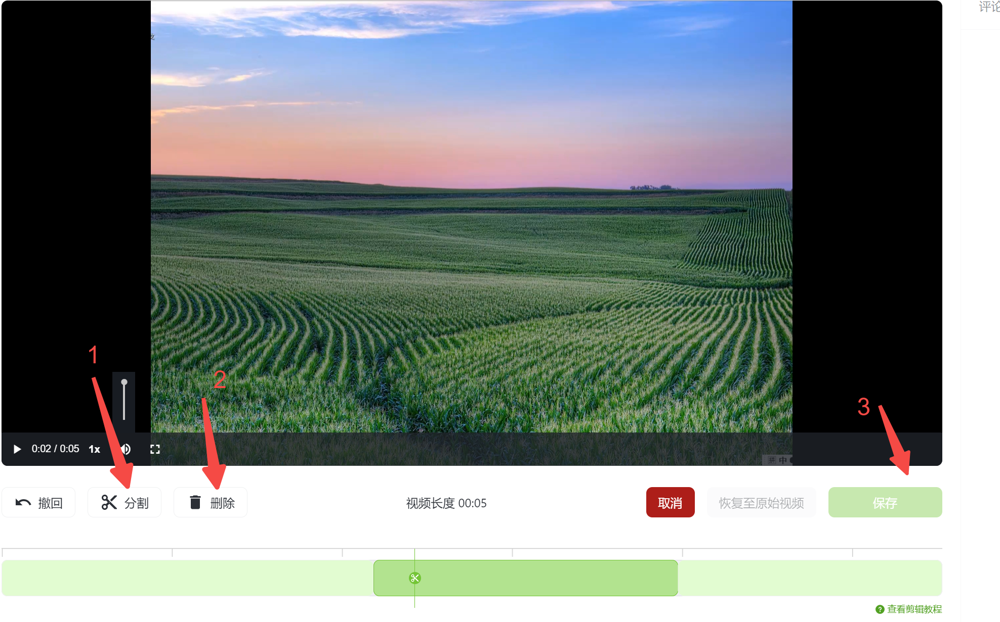

# 视频剪辑

::: warning 注意
目前剪辑功能仅支持桌面端使用，移动端的剪辑功能敬请期待
:::

## 视频教程 {#video}

<iframe src="https://lusun.com/embed/?id=p90y93rvBb2" width="100%" height="500px" scrolling="no" border="0" frameborder="no" framespacing="0" allowfullscreen="true"></iframe>

## 图文教程 {#text}

1、打开芦笋的客户端，点击上方的小房子图标，可以进入[芦笋云空间](https://lusun.com/dashboard/videos/?ref=help.lusun.com)

<ImgCenter></ImgCenter>

2、点击任意一条视频，进入「编辑」页面，点击右侧的「视频剪辑」

<ImgCenter></ImgCenter>

3、通过「分割」功能，分割出不想要的视频片段

逐一选中不想要的视频片段，点击「删除」

点击「保存」

<ImgCenter></ImgCenter>
