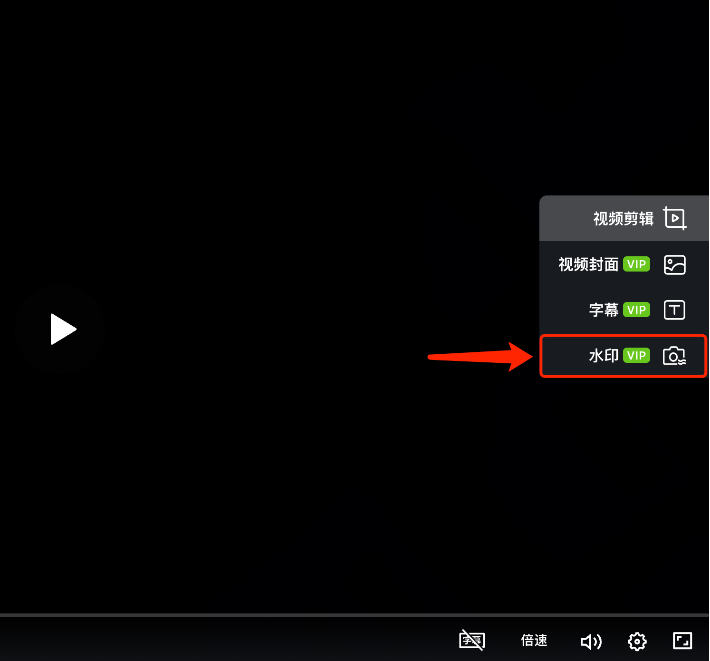

# 自定义水印

## 视频教程 {#video}

<iframe src="https://lusun.com/embed/?id=qPSIm6zpnBQ" width="100%" height="500px" scrolling="no" border="0" frameborder="no" framespacing="0" allowfullscreen="true"></iframe>

## 图文教程 {#post}

如果你希望通过添加自定义水印来增加视频所属标识，起到防止他人盗用视频的效果，你可以尝试以下方法添加。

### 添加水印的入口在哪里？ {#where}

你可以打开电脑上的「[芦笋云空间](https://lusun.com/dashboard/videos)」，找到需要添加水印的视频，播放器右侧功能栏第 4 个为添加水印

<ImgCenter></ImgCenter>
<ImgDesc>芦笋录屏添加水印入口</ImgDesc>

目前，你可以设置水印的文字，并且可以调整透明度，以及位置
