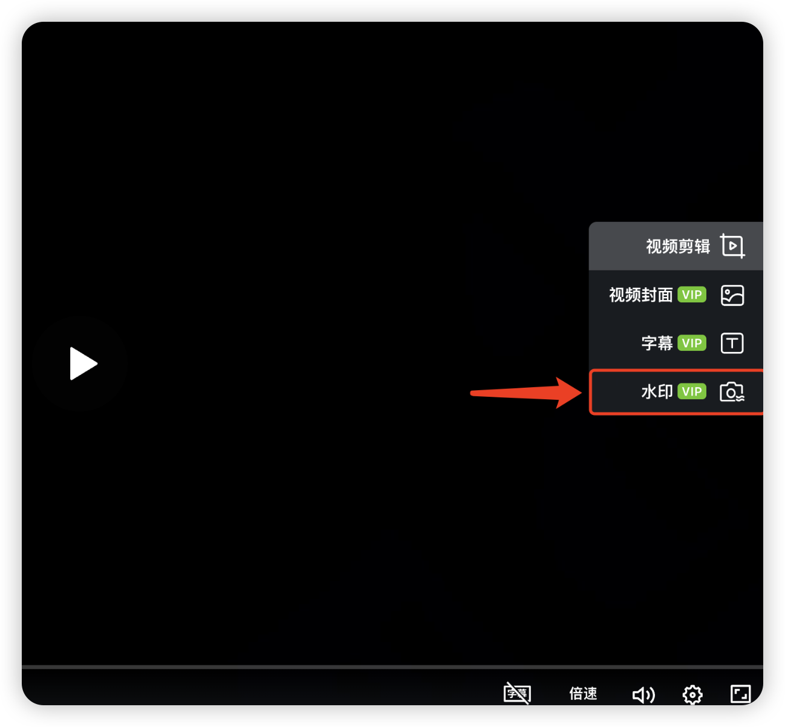
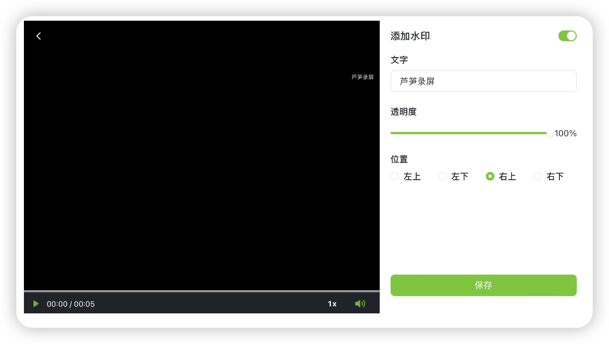

# 自定义水印

## 视频教程 {#video}

<iframe src="https://lusun.com/embed/?id=qPSIm6zpnBQ" width="100%" height="500px" scrolling="no" border="0" frameborder="no" framespacing="0" allowfullscreen="true"></iframe>

## 文字教程 {#post}

水印作用是什么？可以增加视频所属标识，防止他人盗用视频

### 添加水印入口 {#where}

你可以进入「[芦笋录屏云空间](https://lusun.com/dashboard/videos)」打开视频播放界面，播放器右侧功能栏第 4 个为添加水印

<ImgCenter></ImgCenter>
<ImgDesc>设置水印的入口</ImgDesc>

水印支持自定义设置，你可以操作：文字水印自定义、透明度自定义、位置自定义

<ImgCenter></ImgCenter>
<ImgDesc>自定义水印</ImgDesc>

***

推荐更多教程供你参考：[电脑端攻略](../basic/pc.md)｜[手机端攻略](../basic/phone.md)｜[会员特权](../basic/vip.md)｜[进阶教程](./)｜[联系我们](../contact.md)\

