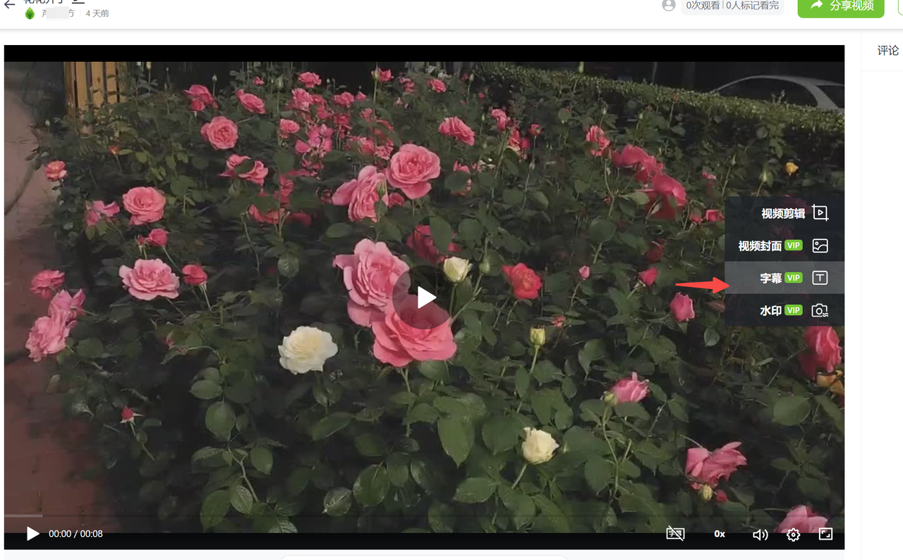
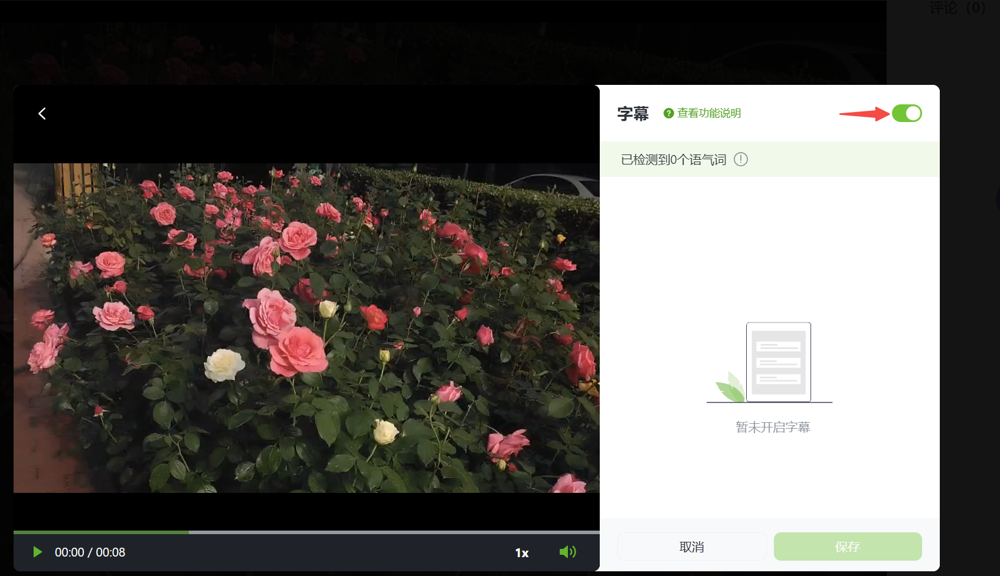

# 字幕教程

## 视频教程 {#video}

<iframe src="https://lusun.com/embed/?id=CDmkPt85Aa8" width="100%" height="500px" scrolling="no" border="0" frameborder="no" framespacing="0" allowfullscreen="true"></iframe>

## 图文教程 {text}

1、打开芦笋的客户端，点击上方的小房子图标，可以进入[芦笋云空间](https://lusun.com/dashboard/videos/?ref=help.lusun.com)

<ImgCenter></ImgCenter>

2、点击任意一条视频，进入「编辑」页面，点击右侧的「字幕」

<ImgCenter></ImgCenter>

3、打开「字幕」按钮，就可以智能识别字幕了

<ImgCenter></ImgCenter>
