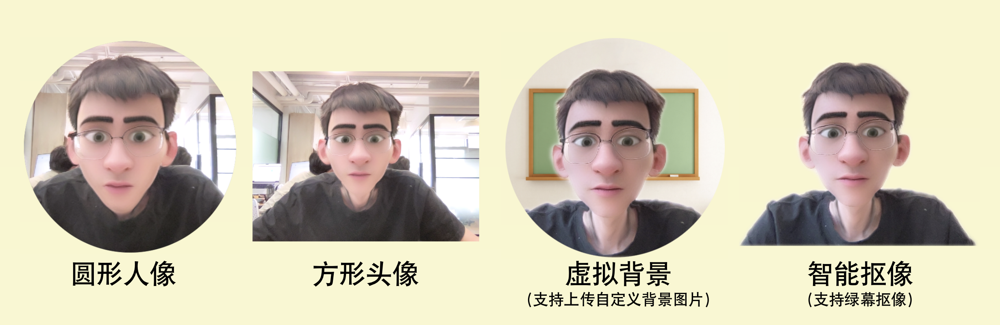

# 电脑端芦笋录屏攻略

## 整体介绍—如何使用电脑录制 {#overview}

<iframe src="https://lusun.com/embed/?id=nrLsJuK8lZJ" width="100%" height="500px" scrolling="no" border="0" frameborder="no" framespacing="0" allowfullscreen="true"> </iframe>

## 分步教程 {#part}

### 芦笋录屏如何下载 {#download}

你可以通过以下两种方式，下载使用芦笋录屏的电脑客户端

1. 百度搜索「芦笋官网」，访问芦笋录屏网页
2. 浏览器访问网址 [lusun.com](https://lusun.com)

<iframe src="https://lusun.com/embed/?id=Zom2AUGEPbx" width="100%" height="500px" scrolling="no" border="0" frameborder="no" framespacing="0" allowfullscreen="true"></iframe>

### 录制详情介绍 {#details}

#### 三种录制模式 {#three}

芦笋录屏提供了【仅人像】、【人像 + 屏幕】、【仅屏幕】三种录制模式，下面的简短视频演示了三种模式对应的效果，帮助你快速了解录制的主功能

<iframe src="https://lusun.com/embed/?id=F7jdJEYKy67" width="100%" height="500px" scrolling="no" border="0" frameborder="no" framespacing="0" allowfullscreen="true"></iframe>

#### 四种人像模式 {#fourth}

芦笋录屏提供了 4 种人像模式—【圆形人像、方形头像、虚拟背景、智能抠像】，下面的图片展示了 4 种模式对应的效果预览图

<ImgCenter></ImgCenter>
<ImgDesc>芦笋录屏录制人像的 4 种样式</ImgDesc>

<iframe src="https://lusun.com/embed/?id=HHZzCyivDIv" width="100%" height="500px" scrolling="no" border="0" frameborder="no" framespacing="0" allowfullscreen="true"></iframe>

#### 绿幕抠像功能 {#pick}

你可以在芦笋录屏使用绿幕抠像功能，实体绿幕会让抠像的效果更精致。可参考以下视频了解详情

<iframe src="https://lusun.com/embed/?id=Ikd1Rw6476i" width="100%" height="500px" scrolling="no" border="0" frameborder="no" framespacing="0" allowfullscreen="true"></iframe>

#### 其它设置项 {#others}

你可以通过打开芦笋录屏的客户端，点击右上角的头像，里面支持「设置」更多，可以设置摄像头、宽高比例、开/关美颜、镜头翻转、鼠标高亮等。

<ImgCenter></ImgCenter>
<ImgDesc>设置的界面展示</ImgDesc>

#### 录制中的操作介绍 {#actions}

你可以通过观看以下视频快速了解录制过程中，如何查看录制时间、暂停 / 继续录制、取消录制、开关音像设置、使用画笔功能等能力。

<iframe src="https://lusun.com/embed/?id=etvxS4eOK06" width="100%" height="500px" scrolling="no" border="0" frameborder="no" framespacing="0" allowfullscreen="true"></iframe>

### 👉录制后视频存储 {#save}

使用芦笋录制的视频，可以选择保存到本地，也可以选择保存到自己的云空间

<ImgCenter></ImgCenter>
<ImgDesc>录屏后保存到本地/云空间</ImgDesc>

### 👉云空间视频分享 {#share}

<iframe src="https://lusun.com/embed/?id=lOgWlSiInYE" width="100%" height="500px" scrolling="no" border="0" frameborder="no" framespacing="0" allowfullscreen="true"></iframe>

你可以单视频分享文件，也可以整个文件夹一起分享。

* 开放分享，点击链接即可观看
* 密码分享，输入密码即可观看

你也可以选择随时关闭分享按钮，关闭后，Ta 人将无法访问你的文件。

***

推荐更多教程供你参考：[手机端攻略](phone.md)｜[会员特权](vip.md)｜[进阶教程](../advanced/)｜[常见问题](../faq.md)｜[联系我们](../contact.md)
