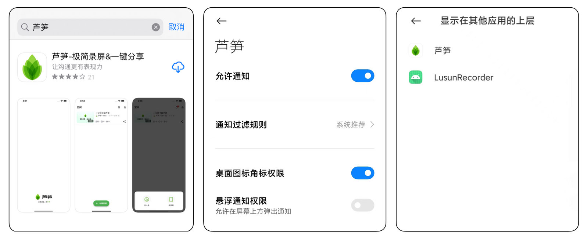
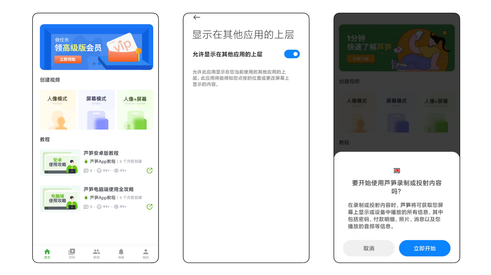
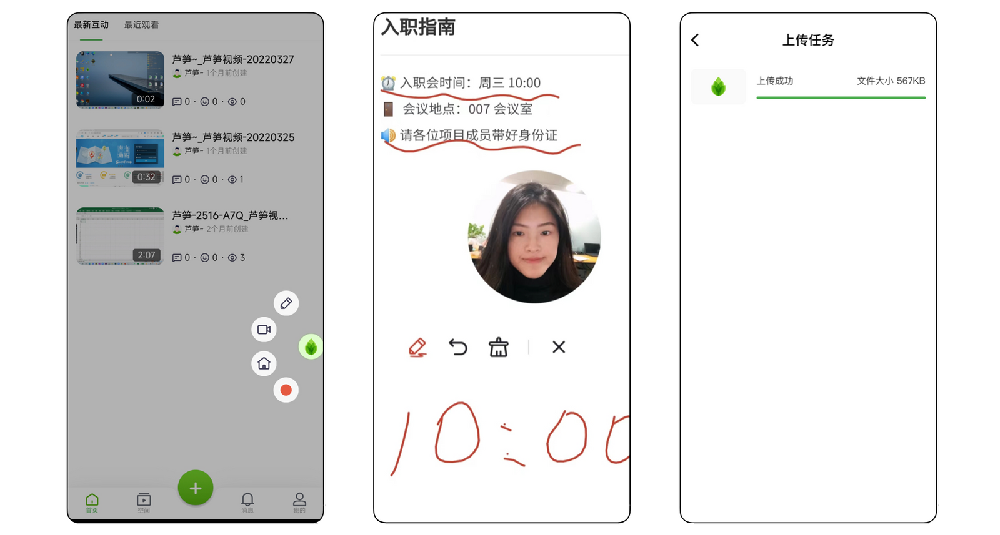
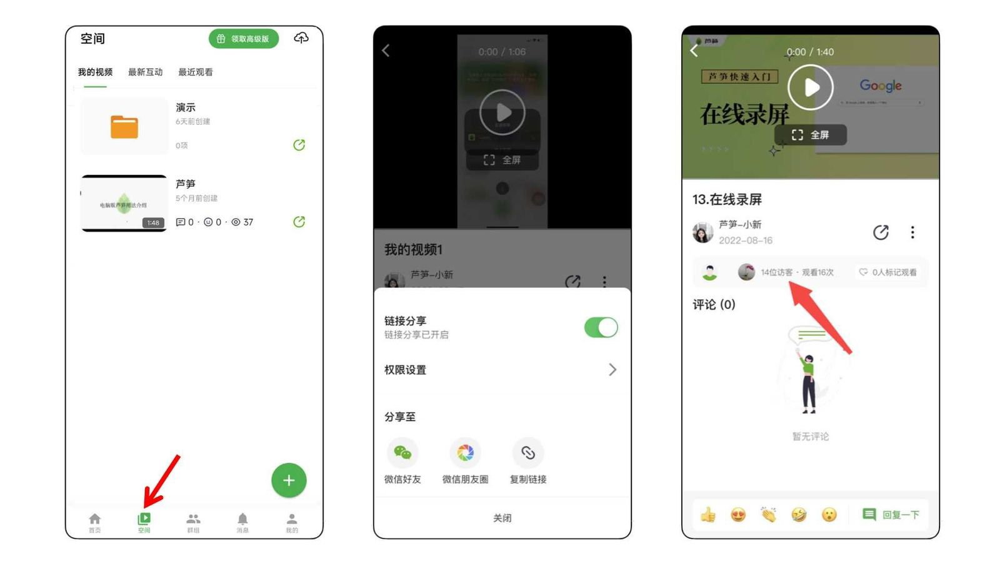
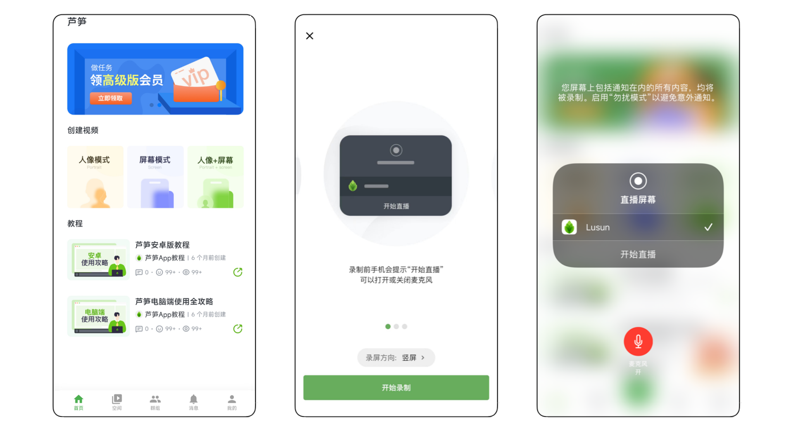
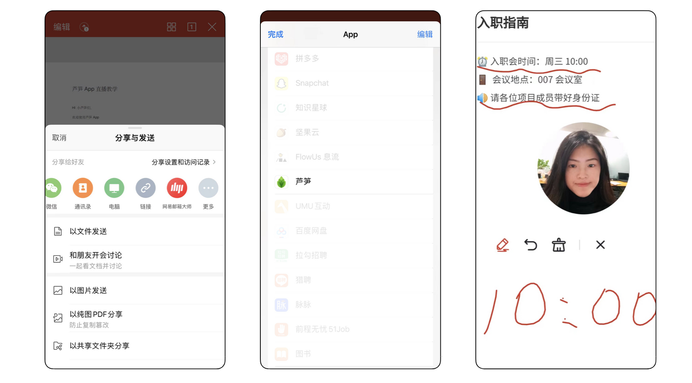
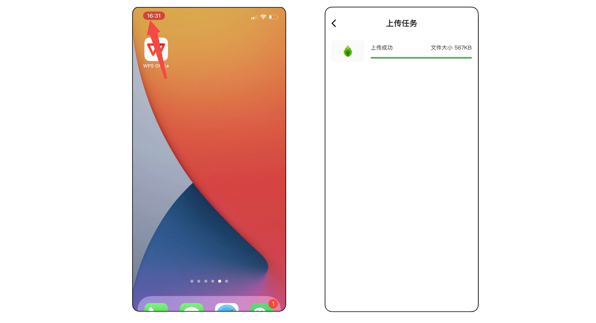
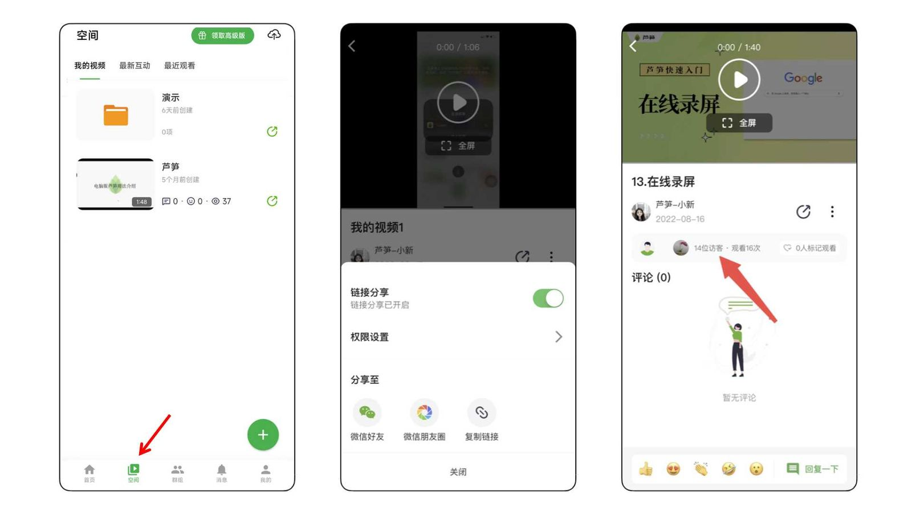

# 手机端芦笋录屏攻略

## 安卓教程 {#android}

### 安卓视频教程 {#android-video}

<iframe src="https://lusun.com/embed/?id=KnLIirUaw9b" width="100%" height="500px" scrolling="no" border="0" frameborder="no" framespacing="0" allowfullscreen="true"></iframe>

### 安卓图文教程 {#android-post}

#### 👉 录制前的设置 {#android-before}

1. 打开芦笋官网 [lusun.com](https://lusun.com/download?ref=help.lusun.com) 或者软件商城搜索「芦笋」并下载
2. 打开手机设置 - 应用设置 - 应用管理 - 芦笋 - 打开芦笋通知权限、允许芦笋悬浮在所有应用最上层👇

<ImgCenter></ImgCenter>
<ImgDesc>lusun 权限设置</ImgDesc>

3. 点击「创建视频」下方按钮开始录制，选择「允许芦笋悬浮在所有应用的最上层」以调用录制悬浮球，然后点击「立即开始」👇

<ImgCenter></ImgCenter>
<ImgDesc>打开「允许显示在其他应用上层」</ImgDesc>

#### 👉 录制过程中的操作 {#android-progress}

1. 打开悬浮球，可以选择画笔、开关摄像头、回到芦笋首页、结束录制
2. 打开想要讲解的画面/课件，使用画笔辅助讲解
3. 点击完成录制，视频自动上传到空间👇

<ImgCenter></ImgCenter>
<ImgDesc>录制中的示意图</ImgDesc>

#### 👉 录制后的视频编辑与分享 {#android-after}

1. 打开「空间」，对视频修改名称、移动至文件夹方便管理
2. 点击分享一键转发至微信，或复制视频链接并分享
3. 点击视频上方的「高级报表」，查看视频访问数据

<ImgCenter></ImgCenter>
<ImgDesc>录制后可保存到云空间</ImgDesc>

## iOS 教程 {#ios}

### iOS 视频教程 {#ios-video}

<iframe src="https://lusun.com/embed/?id=UDBTH8prKgU" width="100%" height="500px" scrolling="no" border="0" frameborder="no" framespacing="0" allowfullscreen="true"></iframe>

### iOS 图文教程 {#ios-post}

#### 👉 录制前的设置 {#ios-before}

1. 打开 app store 搜索「芦笋」并下载
2. 点击加号开始录制，如果录制「人像」或者「屏幕」模式，选择屏幕方向、是否打开麦克风，点击「开始直播」👇

<ImgCenter></ImgCenter>
<ImgDesc>iOS 录制人像/屏幕模式</ImgDesc>

3. 如果录制「人像 + 文件」模式，需要退出芦笋，从微信、WPS 或其他软件 打开 pdf 格式文件，点击右上角三个点 - 使用其他应用打开 - 选择芦笋。然后选择屏幕方向、是否打开麦克风，点击「开始直播」👇

<ImgCenter></ImgCenter>
<ImgDesc>iOS 的人像 + 文件模式</ImgDesc>

#### 👉 录制过程中的操作 {#ios-progress}

1. 「人像」或者「屏幕」模式下，你可以随意切换到想要讲解的界面
2. 「人像 + 文件」模式下，你可以根据个人需要使用画笔辅助讲解
3. 点击屏幕左上角红色键完成录制，你的视频会自动上传到空间👇

<ImgCenter></ImgCenter>
<ImgDesc>iOS 录制后自动上传</ImgDesc>

#### 👉 录制后的视频编辑与分享 {#ios-after}

1. 你可以打开「空间」，对视频修改名称、移动至文件夹方便管理
2. 你也可以点击「分享」一键转发至微信，或复制视频链接并分享
3. 你还可以点击视频上方的「高级报表」，查看视频访问数据

<ImgDesc></ImgDesc>
<ImgDesc>iOS 视频分享</ImgDesc>

以上就是芦笋录屏手机端的全部介绍了，希望对你有所帮助。

***

推荐更多教程供你参考：[电脑端攻略](pc.md)｜[会员特权](vip.md)｜[常见问题](../faq.md)｜[联系我们](../contact.md)
