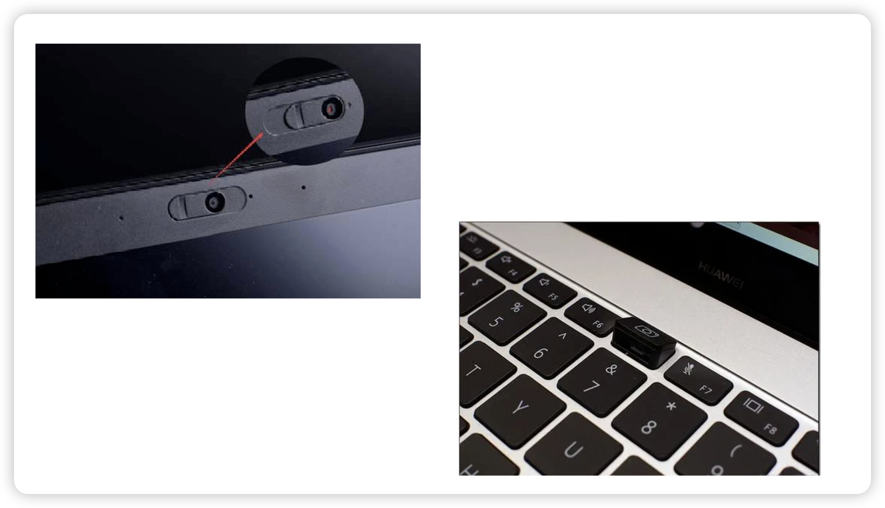
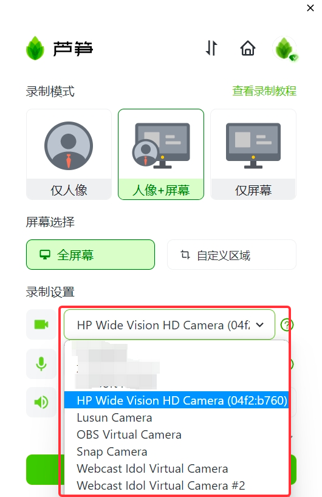

# 摄像头打不开

## 视频教程

<iframe src="https://lusun.com/embed/?id=Z1u56PK0Cvs" width="100%" height="500px" scrolling="no" border="0" frameborder="no" framespacing="0" allowfullscreen="true"></iframe>

## 图文教程

1. 检查电脑摄像头是否有物理开关，如摄像头在键盘上

<imgDesc>摄像头物理开关</imgDesc>

1. 选择其他摄像头列表里的其他选项，看是否能正常显示

<imgDesc>选择其他摄像头看看是否能打开</imgDesc>

3. 若仍无法显示，可使用电脑微信的视频通话功能，检查摄像头是否正常；
4. 若微信能启动摄像头，可能摄像头被其他应用占用。可尝试重启电脑，再次打开芦笋录屏；
5. 若摄像头仍无法使用，请尝试更新摄像头驱动，或去找电脑售后维修。
   1) win7更新驱动：
   [https://jingyan.baidu.com/article/14bd256e9efc5cfa6c261205.html](https://jingyan.baidu.com/article/14bd256e9efc5cfa6c261205.html?ref=help.lusun.com)
   2) win10更新驱动：
   [https://www.bkqs.com.cn/content/kn9q25l38.html](https://www.bkqs.com.cn/content/kn9q25l38.html?ref=help.lusun.com)

若以上教程无法解答问题，可以 [联系我们](../../contact.md) 帮助解决。
