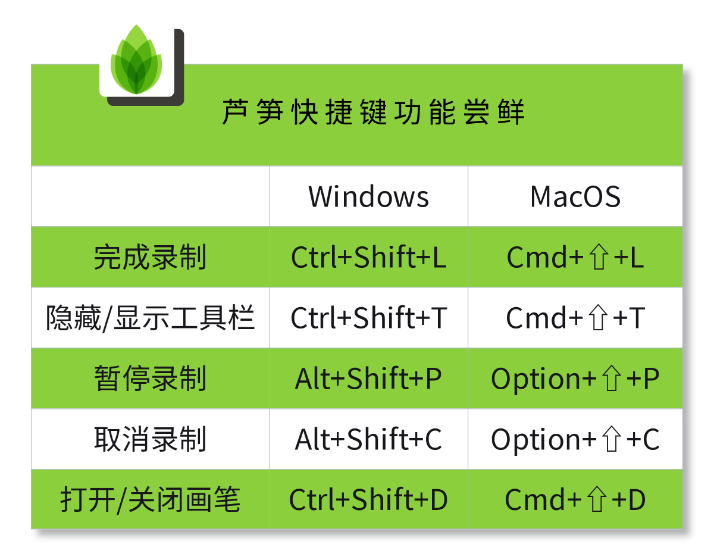
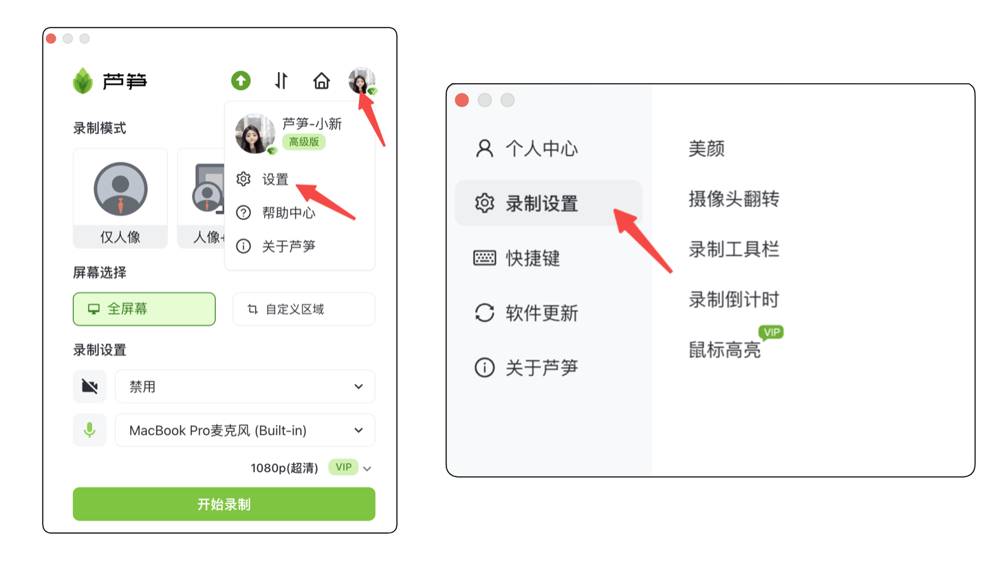

# 如何隐藏录制工具栏

## 视频教程 {#video}

<iframe src="https://lusun.com/embed/?id=4RKMnDVVlLx" width="100%" height="500px" scrolling="no" border="0" frameborder="no" framespacing="0" allowfullscreen="true"></iframe>

## 图文教程 {#post}

### 方法一：快捷键隐藏/显示 {#first}

第一步：选择开始录制，进入 3 秒倒计时

第二步：录制开始后随时使用快捷键打开/隐藏工具栏

<table><thead><tr><th width="164"></th><th width="230">Windows 系统</th><th>MacOS 系统</th></tr></thead><tbody><tr><td>快捷键</td><td>Ctrl + Shift +T</td><td>Command + Shift +T</td></tr></tbody></table>

<ImgCenter></ImgCenter>
<ImgDesc>芦笋录屏的快捷键</ImgDesc>

### 方法二：设置隐藏/显示 {#second}

打开芦笋客户端 - 右上角头像 - 设置 - 录制设置

> 注意，本功能支持 win10 及以上设备使用，设置后，录制过程中仍然可以看到工具栏/芦笋 logo，而录好的视频中工具栏/芦笋 logo 是隐藏的

<ImgCenter></ImgCenter>
<ImgDesc>芦笋录屏隐藏工具栏</ImgDesc>

***

推荐更多教程供你参考：[电脑端攻略](../basic/pc.md)｜[手机端攻略](../basic/phone.md)｜[会员特权](../basic/vip.md)｜[进阶教程](../advanced/)｜[联系我们](../contact.md)
