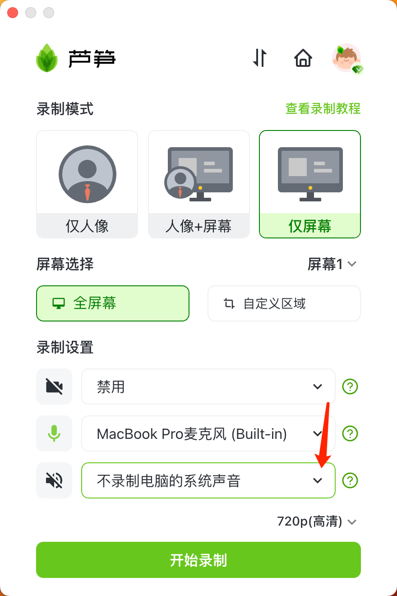
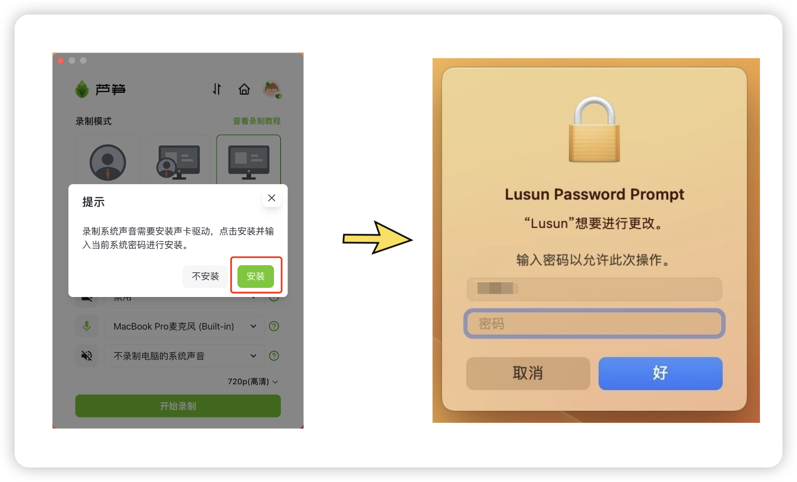

# Mac电脑录制系统声音

如果你是 Mac 电脑，想要录制系统声音的话，需要按以下教程操作

### 第一步

打开 「芦笋录屏」 后，勾选：录制电脑系统声音

<ImgDesc>芦笋录屏录制界面</ImgDesc>

### 第二步

你需要按照系统提示，安装一个声卡驱动，接着输入电脑开机密码，授权安装声卡驱动即可完成

<ImgDesc>点击安装声卡驱动，然后输入密码授权</ImgDesc>

### 第三步

完成上述两步之后，点击开启录制，就可以录制 Mac 电脑的系统声音了

请注意：**当前不支持戴耳机录制系统声音，请打开电脑外放录制**

***

推荐更多教程供你参考：[电脑端攻略](../../basic/pc.md)｜[手机端攻略](../../basic/phone.md)｜[会员特权](../../basic/vip.md)｜[进阶教程](../../advanced/)｜[联系我们](../../contact.md)
